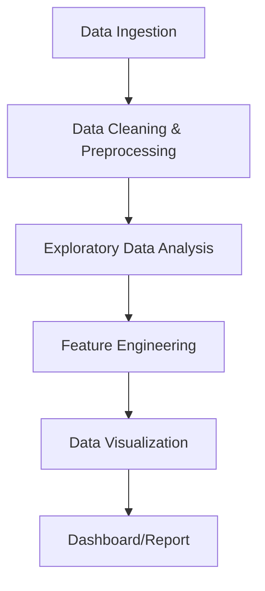

# 🚕 Automatic Taxi Data Analysis & Visualization

**An in-depth analysis of taxi trip data to uncover patterns, trends, and actionable insights using Python and data visualization.**

---

##  Project Overview 📝

This project performs a comprehensive analysis of the [e.g., New York City TLC Taxi Trip] dataset. The primary goal is to process a large volume of trip records to understand passenger behavior, identify peak demand periods, analyze fare structures, and visualize key operational metrics.

By leveraging a suite of powerful data science libraries, this analysis transforms raw, tabular data into clear, interactive visualizations and actionable insights that could help optimize taxi operations and improve profitability.

---

##  Key Questions & Insights ✨

This analysis sought to answer several key business questions:

* **When are the peak hours for taxi demand?**
    * **Insight:** [e.g., Demand surges during evening rush hour (5-7 PM) on weekdays and late at night (11 PM - 2 AM) on weekends.]
* **What is the relationship between trip distance and fare amount?**
    * **Insight:** [e.g., A strong positive correlation exists, but we identified outliers representing potential flat-rate airport trips.]
* **Which payment types are most common?**
    * **Insight:** [e.g., Credit card payments account for over 65% of all transactions, indicating a shift away from cash.]
* **Where are the most popular pickup and dropoff locations?**
    * **Insight:** [e.g., Midtown Manhattan and major transport hubs like Penn Station and JFK Airport are the top hotspots for taxi activity.]

---

##  Dataset 📊

The analysis was performed on the [**Name of Your Dataset, e.g., NYC TLC Trip Record Data**]. This dataset contains approximately [**Number**] million records and includes the following key features:

* `tpep_pickup_datetime`: The date and time when the ride started.
* `tpep_dropoff_datetime`: The date and time when the ride ended.
* `passenger_count`: The number of passengers in the vehicle.
* `trip_distance`: The elapsed trip distance in miles.
* `fare_amount`: The time-and-distance fare calculated by the meter.
* `tip_amount`: Tip amount.
* `total_amount`: The total amount charged to passengers.
* `payment_type`: A numeric code signifying how the passenger paid.

---

##  Data Analysis Pipeline 🏗️

The project follows a standard data science workflow to ensure robust and reproducible results.



1.  **Data Ingestion:** Loading the raw [e.g., CSV/Parquet] data into a Pandas DataFrame.
2.  **Data Cleaning:** Handling missing values, correcting data types, and removing outliers.
3.  **Exploratory Data Analysis (EDA):** Calculating descriptive statistics and creating initial plots to understand the data's distribution and relationships.
4.  **Feature Engineering:** Creating new, valuable features from existing ones (e.g., calculating trip duration, extracting the hour of the day, etc.).
5.  **Data Visualization:** Building interactive charts and maps with Plotly to answer the key business questions and present the findings.

---

##  Technology Stack 🛠️

| Technology | Description |
| :--- | :--- |
| **Python** | The core programming language for the analysis. |
| **Jupyter Notebook**| The interactive environment for developing the analysis. |
| **Pandas** | The essential library for data manipulation, cleaning, and processing. |
| **Matplotlib & Seaborn**| Used for static and statistical plotting during the initial EDA phase. |
| **Plotly** | For creating rich, interactive, and professional data visualizations for the final report. |
| **Scikit-learn** | [Optional: if you did any modeling] Used for machine learning tasks like clustering or regression. |

---

##  Local Setup & Installation ⚙️

To reproduce this analysis locally, follow these steps:

1.  **Clone the repository:**
    ```bash
    git clone [ https://github.com/AnkitMandusia/Automatidata-Taxi-Trips.git]( https://github.com/AnkitMandusia/Automatidata-Taxi-Trips.git)
    cd taxi-data-analysis
    ```

2.  **Set up a Python environment:**
    ```bash
    python -m venv venv
    source venv/bin/activate  # On Windows, use `venv\Scripts\activate`
    ```

3.  **Install dependencies:**
    Create a `requirements.txt` file and then run:
    ```bash
    pip install -r requirements.txt
    ```

---

##  Usage ▶️

1.  **Place the dataset** in the `[e.g., data/]` directory.
2.  **Launch Jupyter Notebook or Jupyter Lab:**
    ```bash
    jupyter notebook
    ```
3.  **Open and run** the `[your_notebook_name.ipynb]` file to see the complete analysis.

---

##  License 📄

This project is licensed under the MIT License. See the [LICENSE](LICENSE) file for details.


This project is licensed under the MIT License. See the [LICENSE](LICENSE) file for details.
